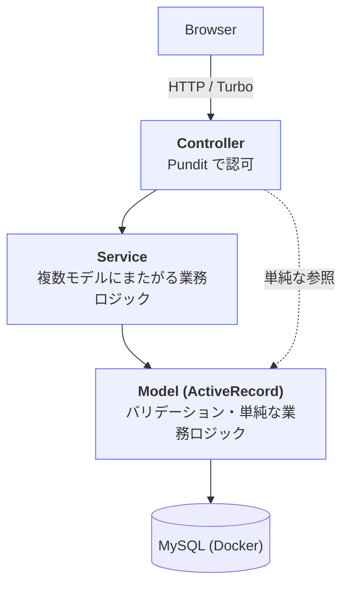
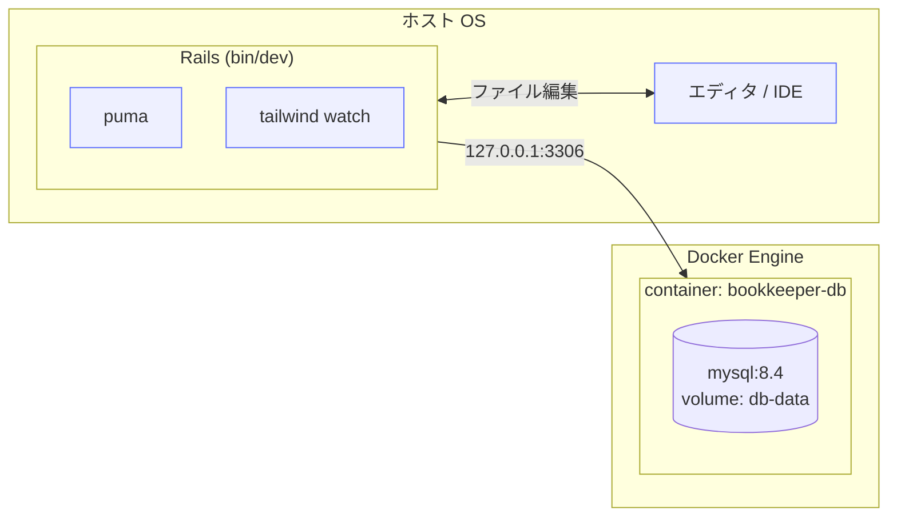

# アーキテクチャ

## レイヤ構成



開発時、MySQL はホスト側ではなく Docker コンテナで稼働する。
Rails 本体はホスト側で動き、`127.0.0.1:3306` 経由でコンテナの MySQL に接続する。

## 各層の責務

### Controller (`app/controllers/`)

- HTTP リクエストの受付と Response 返却のみ。
- Strong Parameters で入力をホワイトリスト化。
- Pundit で認可チェック（`authorize @record`）。
- 複雑なロジックは Service に委譲。
- 1 アクション 15 行を目安に収める。

### Service (`app/services/`)

- 複数モデルにまたがる業務処理（例: 貸出処理 = 在庫減算 + 貸出記録作成 + 通知）。
- 命名は「対象リソース + 操作 + Service」（例: `LendingRequestService`）。
- 公開メソッドは `call` 一つに揃える。
- 結果は明示的な値オブジェクト（成功/失敗 + メッセージ）で返す。`Data.define` で定義するが、`success?` は自動生成されないため明示的に定義する:

  ```ruby
  Result = Data.define(:success, :message) do
    def success? = success
  end
  ```

  呼び出し側: `result = LendingRequestService.new(...).call` → `result.success?`

#### 本プロジェクトの Service 一覧

| クラス名 | 責務 |
|---|---|
| `LendingRequestService` | 借用申請（在庫チェック + Lending 作成） |
| `LendingApprovalService` | 承認（state 変更 + 在庫減算 + 通知 + 監査ログ、トランザクション内） |
| `LendingReturnService` | 返却（state 変更 + 在庫増加） |
| `LendingRejectionService` | 却下（state 変更 + 通知） |

各 Service の副作用の詳細は `@docs/api-spec.md` の「エンドポイント詳細」参照。

### Model (`app/models/`)

- バリデーション、アソシエーション、スコープ、単純な属性ベースのロジック。
- 単一モデルで完結する `published?` のようなメソッドはここに置く。
- コールバックは最小限。副作用の大きい処理は Service に逃がす。
- Ransack を使うモデルは `ransackable_attributes` と `ransackable_associations` を必ず定義する（未定義だと View レンダリング時に実行時エラーになる）。`has_many` アソシエーションを持つモデルは両方の定義が必要。

### Policy (`app/policies/`)

- リソースごとに `XxxPolicy` を 1 ファイル。
- `index?`, `show?`, `create?`, `update?`, `destroy?` を定義。
- `Scope` を使って一覧の絞り込み（例: 一般ユーザーは自分の貸出のみ閲覧）を表現。
- `resource :profile` のようなシングルトンリソースは `@profile = current_user`（`User` インスタンス）になるため、`authorize @profile` だけでは Pundit が `UserPolicy` を参照してしまう。`authorize @profile, policy_class: ProfilePolicy` と明示すること。

### View (`app/views/`)

- ERB。ロジックは Helper か ViewComponent に逃がす。
- 共通レイアウトは `application.html.erb`、管理画面用に `admin.html.erb` を別途用意。
- フォームは `form_with` を使う(Turbo 連携の前提)。

## URL 設計の方針

- リソースフルなルーティングを基本。
- 管理画面は `/admin/` プレフィックスで namespace 分離。
- 認証必須エリアは Devise の `authenticate_user!` で保護。
- 管理画面は `before_action :require_admin` で追加保護。

## トランザクション境界

- 「在庫減算 + 貸出記録作成」のように複数テーブルに書き込む処理は必ず `ActiveRecord::Base.transaction` で囲む。
- Service オブジェクトの `call` メソッド内で境界を張る。
- MySQL の InnoDB を使用する前提（`compose.yaml` の MySQL 8.x ではデフォルト）。

## エラーハンドリング

- 業務エラー（在庫不足など）は例外ではなく結果オブジェクトで返す。
- 想定外エラーは Rails の標準処理に任せる（カスタム rescue を散らさない）。
- 404 / 422 / 500 のカスタムエラーページを用意する。

### 認可エラーの挙動

| エラーの種類 | 挙動 | 実装箇所 |
|---|---|---|
| `Pundit::NotAuthorizedError`（一般認可エラー） | `flash[:alert]` を表示して `root_path` へリダイレクト | `ApplicationController#user_not_authorized` |
| 管理者権限不足 | `flash[:alert]` を表示して `root_path` へリダイレクト | `Admin::BaseController#require_admin` |

フラッシュメッセージの文言（実装ブレ防止のため固定）:

| メソッド | flash[:alert] の文言 |
|---|---|
| `ApplicationController#user_not_authorized` | `この操作を行う権限がありません。` |
| `Admin::BaseController#require_admin` | `管理者のみアクセスできます。` |

## 非同期処理

本フェーズではバックグラウンドジョブを使わない。

- Devise のパスワード再発行などのメール送信は **同期送信** で良い。
  development では `letter_opener` で確認する。
- Rails 8 標準で同梱される Solid Queue / Solid Cache / Solid Cable は
  `rails new` の生成物として残すが、ワーカー（`bin/jobs`）は起動しない。
- Sidekiq / Redis などの追加導入もしない。
- 将来「返却期限リマインドメールの定期配信」等を実装することになった時点で
  Solid Queue を有効化する想定。詳細方針は `docs/stack.md` の
  「ジョブ・キャッシュ・WebSocket」セクション参照。

## インフラ構成（開発環境）



- Rails と DB の間はホストの `127.0.0.1:3306` を経由する（Docker のポートフォワーディング）。
- アプリのソースコードはホスト側にあり、`bin/dev` のファイル監視や IDE 連携をそのまま使える。
- DB のデータは Docker ボリューム `db-data` に永続化される。`docker compose down` してもデータは残る。

## MySQL 固有の注意（実装時）

- `boolean` 型は MySQL では `tinyint(1)` として保存される（Rails からは透過的）。
- JSON 型は `t.json` でカラム定義。PostgreSQL の `jsonb` とは異なるため、検索クエリは `JSON_EXTRACT()` / `->` / `->>` 演算子で行う。
- 一意制約付きインデックスのカラム長制限に注意（utf8mb4 では 1 カラム最大 768 文字相当）。
- `ENUM` 型は使わず、Rails の `enum` 機能で integer カラムに保存する。
